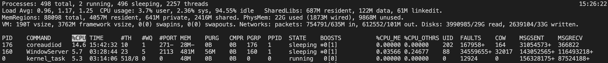

# 调试常用工具

## strace
在linux中，使用strace指令可以跟踪程序的系统调用。  
比如当前有一个可执行文件test。

执行`strace ./test`  
会打印出这个程序都调用了哪些系统调用。

执行`strace -c ./test`   
统计这个程序各个系统调用发生了多少次。  

执行`strace -c -o profile ./test`  
将系统调用的统计结果存入文件 profile中。  

执行`strace -T ./test`  
给出每个系统调用花费的时间。  

执行`strace -t ./test`  
给出每个系统调用发生时的时刻。  
-t精确到秒，-tt精确到微秒，-ttt精确到Unix时间戳的微秒。

执行`strace -p 65743`  
给出pid=65743的进程都使用了哪些系统调用。

&nbsp;

&nbsp;

## gdb(lldb)
在gcc中是gdb，在macOS的llvm中是lldb，只是程序名不同。  
以gdb为例，假设调试test.cpp文件。

`g++ -g -o test test.cpp`  
带上 -g ，生成的可执行文件test就会保留原代码的函数、变量等，否则就会\
转换为内存地址。接下来就可以调试了。

`gdb test`  
进入到用于调试的终端界面。  

在终端界面中，使用其内置的指令，就可以开始调试。
内置指令如下：
* l(或 list)  ：列出一部分源码。
* b(或 break) ：打断点。
  * `b func`   在func函数入口处设置断点
  * `break 23` 在第23行代码处设置断点
* info break ： 查看所有的断点信息。
* r(或者 run) ： 运行代码，遇到断点会停下。
* n(或者 next) ：单步运行代码。
* c(或者 continue): 继续运行代码，直到遇到下一个断点。
* s(或者 step): 跳入到下一行函数的函数体内。
* p(或者 print) ： 查看变量值。
  * `p index`  查看变量index的值。
  * `p array[index]`  查看变量 array[index]的值。
* e(或者 expr)： 在调试环境中，操作被调试的变量。
  * `expr index=4` 将变量index赋值为4.
* bt(或者backtrace) : 查看函数堆栈。
* f(或者 frame): 查看当前堆栈内容。
* finish ： 退出当前的函数。
* q： 退出整个调试。

&nbsp;

&nbsp;

## readelf
在linux中，使用readelf可以查看elf文件的内容。  
可执行二进制文件是elf文件；  
作为动态链接的文件也是elf文件；  
编译但是没有链接的目标文件也是elf文件。

假设test文件就是elf文件。

`readelf -h test`   
查看 test文件的 elf头信息。

&nbsp;

&nbsp;

## objdump
将二进制代码反汇编为汇编代码。  

假设有二进制文件 test  
`objdump test` 将输出汇编代码。

&nbsp;

&nbsp;

## top

`top`    输出一系列系统状态信息，如下图所示：  

头信息解释：  
Processes： 进程总数、正在运行的进程数、正在睡眠的进程数、总线程数；  
Load Avg：最近1min系统负载、最近5min系统负载、最近15min系统负载；  
CPU usage：用户空间占CPU百分比、内核空间占CPU百分比、空闲CPU所占百分比；

linux和macOS上的 top 输出结果有所区别。

